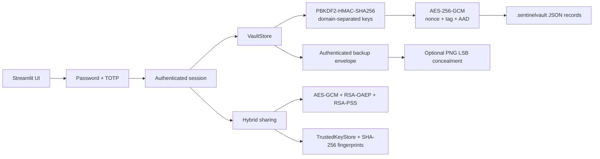

# SentinelVault

SentinelVault is a local Streamlit password vault for a CSE Cyber Security Lab. It combines two-factor authentication, authenticated encryption, protected backups, steganographic concealment, and signed hybrid sharing.

## Objective

Protect stored credentials and demonstrate practical security controls against password guessing, unauthorized vault access, ciphertext tampering, backup misuse, and sharing-package impersonation.

## Features

- bcrypt master-password hashing
- RFC 6238 TOTP login with replay prevention and shared rate limiting
- AES-256-GCM credential encryption with fresh 96-bit nonces, authentication tags, and AAD
- PBKDF2-HMAC-SHA256 key derivation with separate domains for vault, private-key, and backup keys
- Credential add, search, password masking, edit, and delete operations
- Secure metadata-only storage preview
- Authenticated JSON backups and optional PNG LSB concealment
- In-session restore and password-plus-TOTP disaster recovery
- Hybrid credential sharing with AES-GCM, RSA-OAEP, and RSA-PSS
- SHA-256 public-key fingerprints and a persistent `TrustedKeyStore`
- Five-minute inactivity timeout and centralized session cleanup
- Interactive tamper demonstrations for backups and sharing packages

## Architecture



## Repository Structure

```text
app.py                 Streamlit shell, routing, timeout, logout
auth/                  bcrypt, TOTP, rate limiting, session cleanup
vault/                 AES-GCM, PBKDF2, credential models, storage, backups
sharing/               RSA keys, fingerprints, trusted contacts, packages
stego/                 PNG LSB embedding and extraction
ui/                    Login, dashboard, backup, and sharing pages
tests/                 Unit, integration, and security tests
context.md             Security context and design rationale
workflow.md            Technical implementation workflow
DEMO_GUIDE.md          Frontend-first demonstration script
```

## Installation and Run

```powershell
python -m venv .venv
.\\.venv\\Scripts\\Activate.ps1
pip install -r requirements.txt
streamlit run app.py
```

Open `http://localhost:8501`.

## Testing

```powershell
.\\.venv\\Scripts\\pytest.exe -q
```

Current result: **38 passed**.

## Security Mechanisms

| Mechanism            | Protection provided                                                                                                                                      |
| -------------------- | -------------------------------------------------------------------------------------------------------------------------------------------------------- |
| bcrypt               | Makes stored master-password verification data expensive to crack; the password itself is not stored.                                                    |
| TOTP                 | Adds a second factor after password verification. Codes are six digits, checked with a small clock-drift window, and protected against same-step replay. |
| Rate limiting        | Counts password and TOTP failures together; five failures lock the username for 60 seconds.                                                              |
| PBKDF2-HMAC-SHA256   | Derives 256-bit keys from the master password and a random salt using 600,000 iterations.                                                                |
| Domain separation    | Uses different derivation domains for vault data, the RSA private key, and backup envelopes.                                                             |
| AES-256-GCM          | Provides confidentiality and authenticated integrity for vault, private-key, and backup payloads.                                                        |
| Nonce, tag, and AAD  | Each GCM encryption gets a fresh 12-byte nonce; the authentication tag detects modification; AAD binds data to its context and username.                 |
| RSA-OAEP             | Wraps an ephemeral AES session key for the intended sharing recipient.                                                                                   |
| RSA-PSS              | Signs the sharing package so the recipient can verify sender authenticity and integrity.                                                                 |
| SHA-256 fingerprints | Gives public keys a stable displayed identity.                                                                                                           |
| `TrustedKeyStore`    | Pins contact names to public-key fingerprints and detects a changed key during trusted verification.                                                     |
| Session cleanup      | Removes derived keys, sensitive session values, temporary imports, and widget values on logout or timeout.                                               |

## Backup and Recovery

The **📦 Vault Backup & Steganography** page requires the master password again before creating a version 2 authenticated backup. A standard backup downloads as JSON. A steganographic backup embeds the same encrypted envelope into a PNG using RGB least-significant bits.

The **📥 Restore Vault Backup** tab restores a backup into the active matching account after password verification. The **🔄 Disaster Recovery** tab handles a missing account and requires both the master password and current TOTP code. Disaster recovery refuses to overwrite an existing account. Both restore paths can simulate a corrupted backup and display the resulting authentication failure.

## Secure Sharing

The **🤝 Secure Vault Sharing & Trusted Keys** page creates a version 2 package for selected credentials. The payload is encrypted with an ephemeral AES-256-GCM key, that key is wrapped with the recipient's RSA-2048 public key using OAEP-SHA256, and the package material is signed with the sender's RSA-PSS-SHA256 private key. Recipients verify the signature, decrypt with their private key, review a masked preview, and choose **Merge into My Vault 📥** or **Discard Credentials ❌**.

Packages can be delivered as standard JSON or as a steganographic PNG. A tamper simulation corrupts the signature and demonstrates rejection.

## Steganography

PNG-only RGB LSB steganography conceals a payload inside image pixels. The extractor validates the SentinelVault magic header, payload length, PNG format, and size limits. Steganography is concealment, not encryption: confidentiality and integrity come from AES-GCM or the signed sharing package.

## Trusted Keys and Fingerprints

`get_key_fingerprint()` calculates a SHA-256 fingerprint formatted as `SHA256:XX:XX:...`. The sharing UI displays recipient and sender fingerprints. A contact can be pinned with **Pin & Trust Key**; later verification compares the received key with the stored fingerprint and reports key substitution. Unpinned keys are identified as untrusted and are not automatically treated as verified identity.

## Scope and Limitations

This is a local educational project, not a production password manager. The `.sentinelvault` directory must be protected by the operating system. The rate limiter is process-local and is not suitable for a multi-process deployment. Python and Streamlit cannot guarantee immediate zeroization of immutable strings, and trusted-contact enforcement depends on using the UI's verification path. The TOTP enrollment secret is stored in the local account record so the account can authenticate; access to the local store remains part of the threat model.

See [DEMO_GUIDE.md](DEMO_GUIDE.md) for a presentation-ready walkthrough. See [context.md](context.md) for design rationale and [workflow.md](workflow.md) for the implementation flow.
